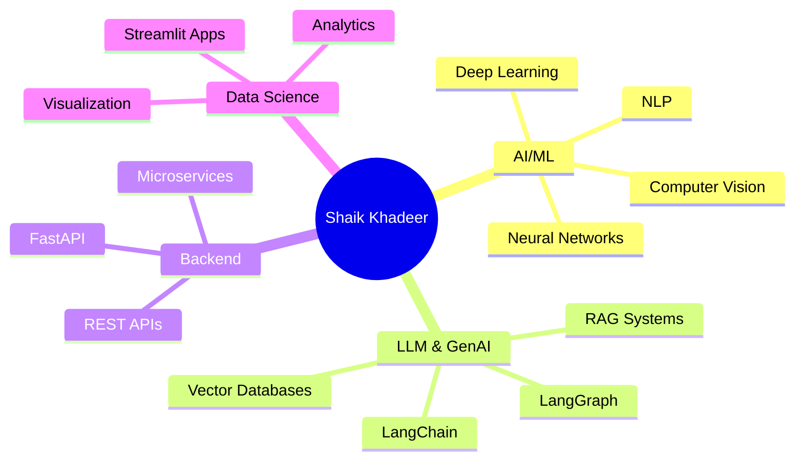

<picture>
  <source media="(prefers-color-scheme: dark)" srcset="https://capsule-render.vercel.app/api?type=waving&color=gradient&customColorList=0,2,30&height=200&section=header&text=Shaik%20Khadeer&fontSize=50&fontColor=fff&animation=twinkling&fontAlignY=35&desc=AI%2FML%20Engineer%20%7C%20Data%20Scientist%20%7C%20Full%20Stack%20Developer&descAlignY=55&descAlign=50"/>
  <source media="(prefers-color-scheme: light)" srcset="https://capsule-render.vercel.app/api?type=waving&color=gradient&customColorList=0,2,30&height=200&section=header&text=Shaik%20Khadeer&fontSize=50&fontColor=fff&animation=twinkling&fontAlignY=35&desc=AI%2FML%20Engineer%20%7C%20Data%20Scientist%20%7C%20Full%20Stack%20Developer&descAlignY=55&descAlign=50"/>
  
</picture>

<div align="center">
  
  <!-- Typing SVG -->
  <a href="https://git.io/typing-svg"></a>

  <br/><br/>
  
  <!-- Badges -->
  <a href="https://github.com/khadeerCollage">
    
  </a>
  <a href="https://github.com/khadeerCollage">
    
  </a>
  <a href="https://www.linkedin.com/in/shaik-khadeer-367474288/">
    
  </a>
  
  <br/><br/>
  
  <!-- Profile Stats -->
  
  <a href="https://github.com/khadeerCollage?tab=followers"></a>
  <a href="https://github.com/khadeerCollage?tab=repositories"></a>
  

</div>

---

<div align="center">
  
</div>

---

##  &nbsp;About Me


```yaml
👤 Name: Shaik Khadeer
🎓 Education: Student at RGUKT
   Rajiv Gandhi University of Knowledge Technologies
   Andhra Pradesh, India

📍 Location: Chilakaluripeta, Palnadu
   Andhra Pradesh, India 🇮🇳

💼 Current Focus:
   - 🤖 Machine Learning & Deep Learning
   - 🧠 LLMs & RAG Applications
   - ⚡ FastAPI Backend Development
   - 📊 Data Science & Analytics

🎯 2025 Goals:
   - Master LangChain & LangGraph
   - Build Production-Ready AI Apps
   - Contribute to Open Source AI Projects

📫 Contact: skr7993257687@gmail.com

🌟 Fun Fact: "I turn data into insights
             and coffee into code! ☕"
```

<br clear="both"/>

---

##  &nbsp;What I'm Building

<div align="center">

| 🔥 Recent Projects | 🛠️ Tech Stack |
|:---|:---|
| **🤖 RAG Audio Bot** - Voice-enabled AI assistant using RAG | LangChain, FastAPI, Python |
| **💬 FastAPI Gemini** - Gemini API integration service | FastAPI, Google Gemini, Python |
| **📊 ML Streamlit App** - Interactive ML model deployment | Streamlit, Scikit-learn, Python |
| **🩺 Diabetes Prediction** - Healthcare ML web application | Jupyter, Streamlit, ML |
| **🧠 Deep Learning Models** - Neural network experiments | TensorFlow, PyTorch, Keras |
| **🔗 LangChain Projects** - LLM-powered applications | LangChain, LangGraph, VectorDB |
| **🏊 PaddlePaddle Tasks** - Deep learning framework practice | PaddlePaddle, Python |

</div>

---

##  &nbsp;Tech Stack

<div align="center">

### 🤖 AI / Machine Learning


### 🦜 LLM & AI Frameworks


### ⚡ Backend & APIs


### 🗄️ Databases & Vector Stores


### 🛠️ Tools & Platforms


</div>

---

##  &nbsp;GitHub Analytics

<div align="center">
   
  
</div>

<div align="center">
  
</div>

<br/>

<div align="center">
  
</div>

---

##  &nbsp;GitHub Trophies

<div align="center">
  
</div>

---

##  &nbsp;Featured Repositories

<div align="center">
  
  <a href="https://github.com/khadeerCollage/RAG_Audio_Bot">
    
  </a>
  <a href="https://github.com/khadeerCollage/fastapi_gemini">
    
  </a>
  
  <br/><br/>
  
  <a href="https://github.com/khadeerCollage/The-Machine-Learning-streamlit-App">
    
  </a>
  <a href="https://github.com/khadeerCollage/Khadee-Data-Science-Portfolio">
    
  </a>
  
  <br/><br/>
  
  <a href="https://github.com/khadeerCollage/langchain-langGraph-VectorDB">
    
  </a>
  <a href="https://github.com/khadeerCollage/fast-api-projects">
    
  </a>

</div>

---

##  &nbsp;Current Focus Areas

<div align="center">



</div>

<table align="center">
<tr>
<td width="50%">

### 🎯 Currently Working On
- 🤖 Building RAG-powered AI applications
- 🦜 Mastering LangChain & LangGraph
- ⚡ FastAPI microservices architecture
- 📊 ML model deployment pipelines

</td>
<td width="50%">

### 🌱 Currently Learning
- 🧠 Advanced LLM fine-tuning techniques
- 🔗 Multi-agent AI systems
- ☁️ Cloud deployment (AWS/GCP)
- 🐳 Docker & Kubernetes

</td>
</tr>
</table>

---

##  &nbsp;Connect With Me

<div align="center">
  
  <a href="mailto:skr7993257687@gmail.com">
    
  </a>
  <a href="https://www.linkedin.com/in/shaik-khadeer-367474288/">
    
  </a>
  <a href="https://github.com/khadeerCollage">
    
  </a>
  <a href="https://medium.com/@skr7993257687">
    
  </a>

</div>

<br/>

<div align="center">
  
  📍 **Chilakaluripeta, Palnadu, Andhra Pradesh, India** 🇮🇳
  
  🎓 **RGUKT - Rajiv Gandhi University of Knowledge Technologies**
  
</div>

---

##  &nbsp;Contribution Snake

<div align="center">
  <picture>
    <source media="(prefers-color-scheme: dark)" srcset="https://raw.githubusercontent.com/khadeerCollage/khadeerCollage/output/github-snake-dark.svg" />
    <source media="(prefers-color-scheme: light)" srcset="https://raw.githubusercontent.com/khadeerCollage/khadeerCollage/output/github-snake.svg" />
    
  </picture>
</div>

---

<div align="center">
  
### 💭 Random Dev Quote
  
  

</div>

---

<div align="center">

### 📊 Weekly Development Breakdown

<!--START_SECTION:waka-->
```text
Python       ██████████████████░░░░   75.00 %
Jupyter      ████████░░░░░░░░░░░░░░   15.00 %
YAML         ██░░░░░░░░░░░░░░░░░░░░   05.00 %
Markdown     █░░░░░░░░░░░░░░░░░░░░░   03.00 %
Other        █░░░░░░░░░░░░░░░░░░░░░   02.00 %
```
<!--END_SECTION:waka-->

</div>

---

<div align="center">
  
</div>

<div align="center">
  
  **🚀 Open for Collaborations on AI/ML Projects! 🚀**
  
  
  
  
  
  
  
  <br/>
  
  ⭐ **If you like my projects, give them a star!** ⭐
  
</div>
