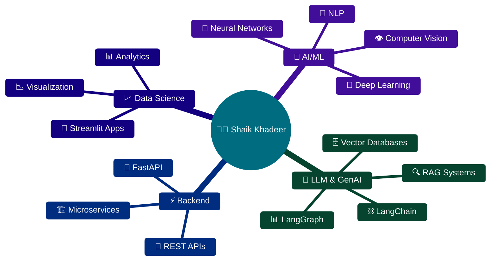

<picture>
  <source media="(prefers-color-scheme: dark)" srcset="https://capsule-render.vercel.app/api?type=waving&color=gradient&customColorList=0,2,30&height=200&section=header&text=Shaik%20Khadeer&fontSize=50&fontColor=fff&animation=twinkling&fontAlignY=35&desc=AI%2FML%20Engineer%20%7C%20Data%20Scientist%20%7C%20Full%20Stack%20Developer&descAlignY=55&descAlign=50"/>
  <source media="(prefers-color-scheme: light)" srcset="https://capsule-render.vercel.app/api?type=waving&color=gradient&customColorList=0,2,30&height=200&section=header&text=Shaik%20Khadeer&fontSize=50&fontColor=fff&animation=twinkling&fontAlignY=35&desc=AI%2FML%20Engineer%20%7C%20Data%20Scientist%20%7C%20Full%20Stack%20Developer&descAlignY=55&descAlign=50"/>
  
</picture>

<div align="center">
  
  <!-- Typing SVG -->
  <a href="https://git.io/typing-svg"></a>

  <br/><br/>
  
  <!-- Badges -->
  <a href="https://github.com/khadeerCollage">
    
  </a>
  <a href="https://github.com/khadeerCollage">
    
  </a>
  <a href="https://www.linkedin.com/in/shaik-khadeer-367474288/">
    
  </a>
  
  <br/><br/>
  
  <!-- Profile Stats -->
  
  <a href="https://github.com/khadeerCollage?tab=followers"></a>
  <a href="https://github.com/khadeerCollage?tab=repositories"></a>
  

</div>

---

<div align="center">
  
</div>

---

##  &nbsp;About Me


```yaml
👤 Name: Shaik Khadeer
🎓 Education: Student at RGUKT
   Rajiv Gandhi University of Knowledge Technologies
   Andhra Pradesh, India

📍 Location: Chilakaluripeta, Palnadu
   Andhra Pradesh, India 🇮🇳

💼 Current Focus:
   - 🤖 Machine Learning & Deep Learning
   - 🧠 LLMs & RAG Applications
   - ⚡ FastAPI Backend Development
   - 📊 Data Science & Analytics

🎯 2025 Goals:
   - Master LangChain & LangGraph
   - Build Production-Ready AI Apps
   - Contribute to Open Source AI Projects

📫 Contact: skr7993257687@gmail.com

🌟 Fun Fact: "I turn data into insights
             and coffee into code! ☕"
```

<br clear="both"/>

---

##  &nbsp;What I'm Building

<div align="center">

| 🔥 Recent Projects | 🛠️ Tech Stack |
|:---|:---|
| **🤖 RAG Audio Bot** - Voice-enabled AI assistant using RAG | LangChain, FastAPI, Python |
| **💬 FastAPI Gemini** - Gemini API integration service | FastAPI, Google Gemini, Python |
| **📊 ML Streamlit App** - Interactive ML model deployment | Streamlit, Scikit-learn, Python |
| **🩺 Diabetes Prediction** - Healthcare ML web application | Jupyter, Streamlit, ML |
| **🧠 Deep Learning Models** - Neural network experiments | TensorFlow, PyTorch, Keras |
| **🔗 LangChain Projects** - LLM-powered applications | LangChain, LangGraph, VectorDB |
| **🏊 PaddlePaddle Tasks** - Deep learning framework practice | PaddlePaddle, Python |

</div>

---

##  &nbsp;Tech Stack

<div align="center">

### 🤖 AI / Machine Learning


### 🦜 LLM & AI Frameworks


### ⚡ Backend & APIs


### 🗄️ Databases & Vector Stores


### 🛠️ Tools & Platforms


</div>

---

<!-- ═══════════════════════════════════════════════════════════════════════ -->
<!-- 📊 GITHUB ANALYTICS - 3D ENHANCED SECTION -->
<!-- ═══════════════════════════════════════════════════════════════════════ -->

<div align="center">
  
</div>

<br/>

<div align="center">
  
  <!-- GitHub Stats Card - Using reliable endpoint -->
  <a href="https://github.com/khadeerCollage">
    
  </a>
  <a href="https://github.com/khadeerCollage">
    
  </a>
  
</div>

<br/>

<div align="center">
  
  <!-- Activity Graph -->
  <a href="https://github.com/khadeerCollage">
    
  </a>
  
</div>

<br/>

<div align="center">
  
  <!-- Profile Summary Card -->
  <a href="https://github.com/khadeerCollage">
    
  </a>
  
</div>

<!-- 3D Language Stats Cards -->
<div align="center">
  <table>
    <tr>
      <td>
        <picture>
          <source media="(prefers-color-scheme: dark)" srcset="https://github-profile-summary-cards.vercel.app/api/cards/repos-per-language?username=khadeerCollage&theme=radical"/>
          
        </picture>
      </td>
      <td>
        <picture>
          <source media="(prefers-color-scheme: dark)" srcset="https://github-profile-summary-cards.vercel.app/api/cards/most-commit-language?username=khadeerCollage&theme=radical"/>
          
        </picture>
      </td>
    </tr>
  </table>
</div>

<!-- ═══════════════════════════════════════════════════════════════════════ -->
<!-- ⏰ PRODUCTIVE TIME - 3D ENHANCED SECTION -->
<!-- ═══════════════════════════════════════════════════════════════════════ -->

<div align="center">
  
  
  
</div>

<div align="center">
  <table>
    <tr>
      <td>
        <picture>
          <source media="(prefers-color-scheme: dark)" srcset="https://github-profile-summary-cards.vercel.app/api/cards/stats?username=khadeerCollage&theme=radical"/>
          
        </picture>
      </td>
      <td>
        <picture>
          <source media="(prefers-color-scheme: dark)" srcset="https://github-profile-summary-cards.vercel.app/api/cards/productive-time?username=khadeerCollage&theme=radical&utcOffset=5.5"/>
          
        </picture>
      </td>
    </tr>
  </table>
</div>

<!-- 3D Glowing Productivity Metrics -->
<div align="center">
  <br/>
  <a href="https://github.com/khadeerCollage">
    
  </a>
  <a href="https://github.com/khadeerCollage">
    
  </a>
  <a href="https://github.com/khadeerCollage">
    
  </a>
</div>

---

<!-- 3D Special Achievement Cards -->
<div align="center">
  <table>
    <tr>
      <td align="center" width="25%">
        
        <br/><br/>
        
        <br/><b>Streak Master</b>
        <br/><sub>Consistent Contributor</sub>
      </td>
      <td align="center" width="25%">
        
        <br/><br/>
        
        <br/><b>Code Rocket</b>
        <br/><sub>27 Projects Contributed</sub>
      </td>
      <td align="center" width="25%">
        
        <br/><br/>
        
        <br/><b>AI Architect</b>
        <br/><sub>ML & Deep Learning</sub>
      </td>
      <td align="center" width="25%">
        
        <br/><br/>
        
        <br/><b>Backend Expert</b>
        <br/><sub>API Development</sub>
      </td>
    </tr>
  </table>
</div>

<br/>

<!-- Languages Mastery -->
<div align="center">
  
</div>

<br/>

<div align="center">
  <table>
    <tr>
      <td align="center">
        
        <br/><b>Python</b>
        <br/><sub>49.26%</sub>
      </td>
      <td align="center">
        
        <br/><b>Jupyter</b>
        <br/><sub>34.99%</sub>
      </td>
      <td align="center">
        
        <br/><b>C</b>
        <br/><sub>10.95%</sub>
      </td>
      <td align="center">
        
        <br/><b>JavaScript</b>
        <br/><sub>0.53%</sub>
      </td>
      <td align="center">
        
        <br/><b>C++</b>
        <br/><sub>0.28%</sub>
      </td>
      <td align="center">
        
        <br/><b>HTML</b>
        <br/><sub>0.28%</sub>
      </td>
    </tr>
  </table>
</div>

<br/>

<!-- 3D Contributor Stats -->
<div align="center">
  <a href="https://github.com/khadeerCollage">
    
  </a>
</div>

<br/>

<!-- 3D Skill Level Indicators -->
<div align="center">
  <table>
    <tr>
      <td width="50%">
        <h4>🎖️ Skill Mastery Levels</h4>
        
        <br/>
        
        <br/>
        
        <br/>
        
        <br/>
        
      </td>
      <td width="50%">
        <h4>🏅 Achievements Unlocked</h4>
        
        <br/>
        
        <br/>
        
        <br/>
        
        <br/>
        
      </td>
    </tr>
  </table>
</div>

---


<!-- ═══════════════════════════════════════════════════════════════════════ -->
<!-- 🔥 CURRENT FOCUS AREAS - 3D ENHANCED SECTION -->
<!-- ═══════════════════════════════════════════════════════════════════════ -->

<div align="center">
  
</div>

<br/>

<div align="center">



</div>

<!-- 3D Focus Cards with Glowing Effects -->
<table align="center">
<tr>
<td width="50%">

<div align="center">
  
</div>

<br/>

- 🤖 Building RAG-powered AI applications
- 🦜 Mastering LangChain & LangGraph
- ⚡ FastAPI microservices architecture
- 📊 ML model deployment pipelines

</td>
<td width="50%">

<div align="center">
  
</div>

<br/>

- 🧠 Advanced LLM fine-tuning techniques
- 🔗 Multi-agent AI systems
- ☁️ Cloud deployment (AWS/GCP)
- 🐳 Docker & Kubernetes

</td>
</tr>
</table>

---

<!-- ═══════════════════════════════════════════════════════════════════════ -->
<!-- 🔗 CONNECT WITH ME - 3D ENHANCED SECTION -->
<!-- ═══════════════════════════════════════════════════════════════════════ -->

<div align="center">
  
</div>

<br/>

<div align="center">
  
  <!-- 3D Social Media Buttons -->
  <a href="mailto:skr7993257687@gmail.com">
    
  </a>
  &nbsp;
  <a href="https://www.linkedin.com/in/shaik-khadeer-367474288/">
    
  </a>
  &nbsp;
  <a href="https://github.com/khadeerCollage">
    
  </a>
  &nbsp;
  <a href="https://medium.com/@skr7993257687">
    
  </a>

</div>

<br/>

<!-- 3D Location Card -->
<div align="center">
  <table>
    <tr>
      <td align="center">
        
        <br/><b>📍 Location</b>
        <br/><sub>Chilakaluripeta, Palnadu</sub>
        <br/><sub>Andhra Pradesh, India 🇮🇳</sub>
      </td>
      <td align="center">
        
        <br/><b>🎓 Education</b>
        <br/><sub>RGUKT - Rajiv Gandhi</sub>
        <br/><sub>University of Knowledge Technologies</sub>
      </td>
      <td align="center">
        
        <br/><b>💼 Status</b>
        <br/><sub>Open for Collaborations</sub>
        <br/><sub>AI/ML Projects</sub>
      </td>
    </tr>
  </table>
</div>

---

<!-- ═══════════════════════════════════════════════════════════════════════ -->
<!--  WEEKLY DEVELOPMENT BREAKDOWN - 3D ENHANCED SECTION -->
<!-- ═══════════════════════════════════════════════════════════════════════ -->

<div align="center">

  

<br/>

<!--START_SECTION:waka-->
```text
🐍 Python       ██████████████████░░░░   75.00 % 🔥 Primary
📓 Jupyter      ████████░░░░░░░░░░░░░░   15.00 % 📊 Analytics
⚙️ YAML         ██░░░░░░░░░░░░░░░░░░░░   05.00 % 🔧 Config
📝 Markdown     █░░░░░░░░░░░░░░░░░░░░░   03.00 % 📄 Docs
💻 Other        █░░░░░░░░░░░░░░░░░░░░░   02.00 % 🛠️ Misc
```
<!--END_SECTION:waka-->

</div>

<!-- 3D Language Breakdown Cards -->
<div align="center">
  <table>
    <tr>
      <td align="center">
        
      </td>
      <td align="center">
        
      </td>
      <td align="center">
        
      </td>
      <td align="center">
        
      </td>
    </tr>
  </table>
</div>

---

---

<!-- ═══════════════════════════════════════════════════════════════════════ -->
<!-- 🚀 FOOTER - 3D PROFESSIONAL CLOSING -->
<!-- ═══════════════════════════════════════════════════════════════════════ -->

<div align="center">
  
</div>

<div align="center">

  <br/><br/>
  
  
  
  <br/><br/>
  
  <!-- 3D Final Badges -->
  
  &nbsp;
  
  &nbsp;
  
  
  <br/><br/>
  
  <!-- 3D Star Call -->
  <table>
    <tr>
      <td align="center">
        
      </td>
      <td align="center">
        <b>If you like my projects, give them a star!</b>
      </td>
      <td align="center">
        
      </td>
    </tr>
  </table>
  
  <br/>
  
  <!-- 3D Profile Visitor Counter -->
  
  
</div>
